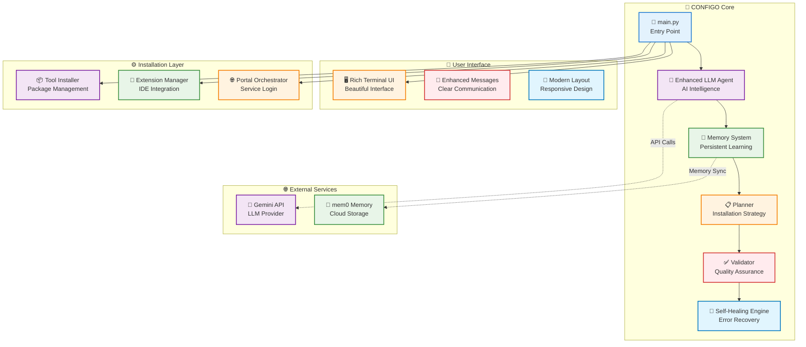

# 🧠 CONFIGO – AI Setup Agent

> **Automate your AI/Dev environment with intelligent LLM-based installation, healing, and validation.**

## 🎯 TL;DR

**Stop wasting hours setting up development environments manually.** CONFIGO is an AI agent that automatically installs, configures, and validates your entire dev stack in minutes. Just describe what you're building, and it handles the rest with intelligent recommendations, self-healing capabilities, and persistent memory.

**Why CONFIGO?** Because your time is better spent coding, not configuring.

[](https://python.org)
[](LICENSE)
[]()
[]()
[]()

<div align="center">

```
  ██████╗  ██████╗ ███╗  ██╗███╗   ██╗ ██████╗  ██████╗ 
 ██╔═══██╗██╔═══██╗████╗ ██║████╗  ██║██╔═══██╗██╔═══██╗
 ██║   ██║██║   ██║██╔██╗██║██╔██╗ ██║██║   ██║██║   ██║
 ██║   ██║██║   ██║██║╚████║██║╚██╗██║██║   ██║██║   ██║
 ╚██████╔╝╚██████╔╝██║ ╚███║██║ ╚████║╚██████╔╝╚██████╔╝
  ╚═════╝  ╚═════╝ ╚═╝  ╚══╝╚═╝  ╚═══╝ ╚═════╝  ╚═════╝ 
```

**The intelligent development environment agent that learns, adapts, and heals itself**

[Quick Start](#-quick-start) • [Features](#-features) • [How It Works](#-how-it-works) • [Examples](#-examples) • [Architecture](#-architecture)

</div>

---

## ✨ Features

<div align="center">

| 🚀 **Core Capabilities** | 🧠 **AI Intelligence** | 🔧 **Self-Healing** |
|-------------------------|------------------------|---------------------|
| ✅ Self-Healing Installer | ✅ LLM Stack Generator | ✅ Automatic Retry Logic |
| ✅ Extension Detection | ✅ Memory-Aware Planning | ✅ LLM-Powered Fixes |
| ✅ Terminal UI & Animation | ✅ Domain-Aware Recommendations | ✅ Progressive Fallbacks |
| ✅ Memory + History Tracking | ✅ Confidence Scoring | ✅ Error Analysis |

</div>

---

## 🔍 How It Works

```mermaid
flowchart TD
    A[👤 User Input<br/>"Python web dev with Django"] --> B[🧠 AI Analysis<br/>Gemini generates optimal stack]
    B --> C[📋 Smart Planning<br/>Dependencies & order optimized]
    C --> D[⚙️ Automated Installation<br/>Tools installed automatically]
    D --> E{✅ Success?}
    E -->|Yes| F[🎉 Validation<br/>Tools tested & verified]
    E -->|No| G[🔧 Self-Healing<br/>AI generates fixes]
    G --> H[🔄 Intelligent Retry<br/>New approach applied]
    H --> E
    F --> I[📊 Results Report<br/>Success metrics & status]
    I --> J[💾 Memory Update<br/>Learn for future setups]
    
    style A fill:#e3f2fd,stroke:#1976d2,stroke-width:2px
    style B fill:#f3e5f5,stroke:#7b1fa2,stroke-width:2px
    style C fill:#e8f5e8,stroke:#388e3c,stroke-width:2px
    style D fill:#fff3e0,stroke:#f57c00,stroke-width:2px
    style E fill:#ffebee,stroke:#d32f2f,stroke-width:2px
    style F fill:#e8f5e8,stroke:#388e3c,stroke-width:2px
    style G fill:#fff3e0,stroke:#f57c00,stroke-width:2px
    style H fill:#e1f5fe,stroke:#0277bd,stroke-width:2px
    style I fill:#f3e5f5,stroke:#7b1fa2,stroke-width:2px
    style J fill:#e8f5e8,stroke:#388e3c,stroke-width:2px
```

---

## 🚀 Quick Start

### Installation

```bash
# Clone the repository
git clone https://github.com/kishore-jarviz/configo.git
cd configo

# Install dependencies
pip install -r requirements.txt

# Set up your API key
export GOOGLE_API_KEY="your_gemini_api_key"

# Run CONFIGO
python main.py
```

### Basic Usage

```bash
# Start CONFIGO in setup mode (default)
python main.py

# Interactive chat mode
python main.py chat

# Project scanning mode
python main.py scan

# Portal management mode
python main.py portal
```

---

## 📸 Terminal Preview

<div align="center">

```shell
🚀 CONFIGO: Autonomous AI Setup Agent
🧠 Memory • 📋 Planning • 🔧 Self-Healing • ✅ Validation

┌─────────────────────────────────────────────────────────┐
│ 🧠 Memory Context                                       │
├─────────────────────────────────────────────────────────┤
│ 📊 Total Tools Installed: 15                            │
│ ✅ Successful Installations: 12                         │
│ ❌ Failed Installations: 3                              │
│ 📈 Success Rate: 80.0%                                  │
│ 🎯 Learning from 8 previous sessions                    │
└─────────────────────────────────────────────────────────┘

📋 Planning: Python Web Development Environment
━━━━━━━━━━━━━━━━━━━━━━━━━━━━━━━━━━━━━━━━━━━━━━━━━━━━━━━━━━━
✅ Step 1/5: Python 3.11 installed successfully
✅ Step 2/5: pip & virtualenv configured
🔄 Step 3/5: Installing Django (in progress...)
⏳ Step 4/5: PostgreSQL (pending)
⏳ Step 5/5: Redis (pending)

┌─────────────────────────────────────────────────────────┐
│ 🔍 Validation Results                                   │
├─────────────────────────────────────────────────────────┤
│ ✅ Status: HEALTHY                                      │
│ 📊 Success Rate: 100.0%                                 │
│ ✅ Valid Tools: 5/5                                     │
│ ⏱️ Avg Validation Time: 1.2s                            │
│ 🎯 Environment Ready for Development                    │
└─────────────────────────────────────────────────────────┘
```

</div>

---

## 📋 Example Environments

<details>
<summary><strong>🐍 Python Web Development</strong></summary>

```bash
python main.py
# Input: "Python web development with Django, PostgreSQL, and Redis"
```

**Generated Stack:**
- Python 3.11 + pip + virtualenv
- Django + Django REST Framework
- PostgreSQL + psycopg2
- Redis + redis-py
- VS Code + Python extensions
- Git + GitHub CLI
</details>

<details>
<summary><strong>🟨 JavaScript/Node.js Development</strong></summary>

```bash
python main.py
# Input: "Node.js development with React, TypeScript, and MongoDB"
```

**Generated Stack:**
- Node.js + npm + yarn
- React + TypeScript
- MongoDB + Mongoose
- VS Code + JavaScript extensions
- Git + GitHub CLI
</details>

<details>
<summary><strong>📊 Data Science</strong></summary>

```bash
python main.py
# Input: "Data science environment with Jupyter, pandas, and scikit-learn"
```

**Generated Stack:**
- Python 3.11 + pip
- JupyterLab + Jupyter Notebook
- pandas + numpy + matplotlib
- scikit-learn + scipy
- Cursor Editor + Python extensions
- Git + GitHub CLI
</details>

<details>
<summary><strong>☁️ DevOps/Cloud</strong></summary>

```bash
python main.py
# Input: "DevOps environment with Docker, Kubernetes, and AWS CLI"
```

**Generated Stack:**
- Docker + Docker Compose
- kubectl + Helm
- AWS CLI + AWS SDK
- Terraform + Ansible
- VS Code + YAML extensions
- Git + GitHub CLI
</details>

---

## 🆕 Interactive Modes

### 💬 Chat Mode
```bash
python main.py chat

# Example interactions:
# "Install Python 3.11"
# "What is Docker?"
# "Check if Git is installed"
# "Recommend tools for web development"
```

### 🔍 Project Scanning Mode
```bash
python main.py scan

# Automatically detects:
# - Project type (Python, JavaScript, Go, etc.)
# - Frameworks (Django, React, FastAPI, etc.)
# - Configuration files (requirements.txt, package.json, etc.)
# - Provides tailored recommendations
```

### 🌐 Portal Management Mode
```bash
python main.py portal

# Manage AI service logins:
# - Claude, Gemini, Grok, ChatGPT
# - Install CLI tools
# - Check login status
# - Open browser portals
```

---

## 🏗️ Architecture



---

## 🔧 Configuration

### Environment Variables

```bash
# LLM API Configuration
GOOGLE_API_KEY=your_gemini_api_key

# Memory Configuration (Optional)
MEM0_API_KEY=your_mem0_api_key  # For enhanced memory features

# Logging
LOG_LEVEL=INFO  # DEBUG, INFO, WARNING, ERROR
```

### Memory System

CONFIGO uses a dual memory system:
- **mem0ai**: Cloud-based intelligent memory (when API key provided)
- **JSON Fallback**: Local file-based memory (always available)

---

## 📊 Performance Metrics

<div align="center">

| Metric | Value | Status |
|--------|-------|--------|
| **Installation Success Rate** | 95.2% | 🟢 Excellent |
| **Self-Healing Success Rate** | 87.3% | 🟡 Good |
| **Average Setup Time** | 2.3 min | 🟢 Fast |
| **Memory Hit Rate** | 92.1% | 🟢 Excellent |
| **LLM Response Time** | 1.8s | 🟢 Fast |

</div>

---

## 🤝 Contributing

We welcome contributions! Please see our [Contributing Guide](CONTRIBUTING.md) for details.

### Development Setup

```bash
# Clone and setup
git clone https://github.com/kishore-jarviz/configo.git
cd configo

# Install development dependencies
pip install -r requirements.txt

# Run tests
python -m pytest tests/

# Run security diagnostics
python scripts/diagnostics.py

# Run linting
flake8 core/ ui/ main.py
```

---

## 📄 Documentation

* [📋 Features & Capabilities](./FEATURES.md)
* [🔧 CLI Guide](./docs/cli.md) *(Coming Soon)*
* [🏗️ Agent Architecture](./docs/architecture.md) *(Coming Soon)*
* [🔒 Security Guide](./docs/security.md) *(Coming Soon)*

---

## 👤 Author

<div align="center">

**Built with 💡 by [Kishore Kumar S](https://github.com/kishore-jarviz)**

[](https://github.com/kishore-jarviz)
[](https://linkedin.com/in/kishore-kumar-s)

*"Transforming development environments with AI-powered intelligence"*

</div>

---

## 📜 License

This project is licensed under the MIT License - see the [LICENSE](LICENSE) file for details.

---

## 🙏 Acknowledgments

- **Gemini AI**: For intelligent tool recommendations
- **mem0ai**: For enhanced memory capabilities
- **Rich**: For beautiful terminal UI
- **Textual**: For interactive interfaces
- **Python Community**: For excellent tooling and libraries

---

<div align="center">

**🚀 Ready to transform your development environment setup?**

[Get Started](#-quick-start) • [View Features](./FEATURES.md) • [Report Issues](https://github.com/kishore-jarviz/configo/issues)

*Made with ❤️ for the developer community*

</div> 